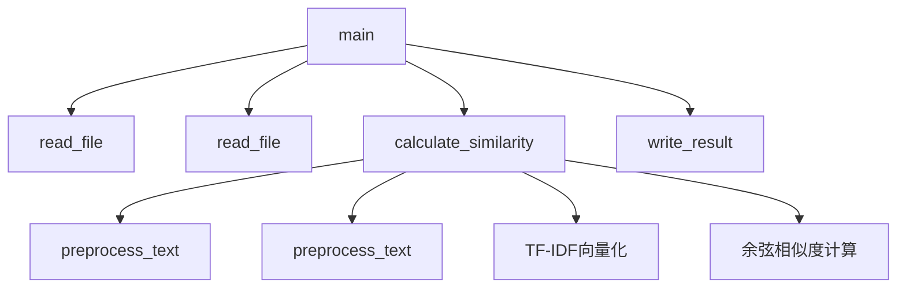
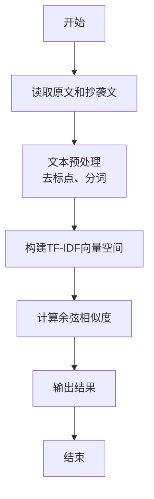

# 软件工程第三次作业

## 项目参与成员
###计科4班 3123004433 陈东楷
###计科4班 3123004441 赖顺炜

| 课程 | 软件工程 |
|---|---|
| 作业要求 |个人编程 |
| 作业的目标 | ：实现一个自动生成小学四则运算题目的命令行程序（也可以用图像界面，具有相似功能）。|
|GitHub仓库 |https://github.com/chendongkai2004/3123004433|

## 一、PSP表格
| PSP2.1 | Personal Software Process Stages | 预估耗时（分钟） | 实际耗时（分钟） |
|--------|-----------------------------------|------------------|------------------|
| Planning | 计划 | 20 | 15|
| · Estimate | · 估计这个任务需要多少时间 | 10 |15 |
| Development | 开发 | 320 | 350|
| · Analysis | · 需求分析（包括学习新技术） | 60 | 75|
| · Design Spec | · 生成设计文档 |30  | 35|
| · Design Review | · 设计复审 |15  | 18|
| · Coding Standard | · 代码规范（为目前的开发制定合适的规范） | 20 |35 |
| · Design | · 具体设计 | 150 | 180|
| · Coding | · 具体编码 | 30 | 15|
| · Code Review | · 代码复审 | 10 | 12|
| · Test | · 测试（自我测试，修改代码，提交修改） |  60|60 |
| Reporting | 报告 | 35 |38 |
| · Test Report | · 测试报告 | 15 |10 |
| · Size Measurement | · 计算工作量 | 10 |15 |
| · Postmortem & Process Improvement Plan | · 事后总结，并提出过程改进计划 | 425 | 452|


##二、 计算模块接口的设计与实现过程

###2.1设计概述

我设计了基于TF-IDF和余弦相似度的文本相似度计算模块，采用面向过程的设计模式，代码组织清晰，功能模块化。

###2.2 代码组织结构

1. **主要模块**：单个Python文件包含所有功能
2. **函数设计**：5个核心函数，各司其职
3. **依赖关系**：
   - `main()` 作为程序入口，协调所有函数
   - `calculate_similarity()` 作为核心计算函数，调用其他辅助函数

### 2.3函数关系图



### 2.4关键算法流程



###2.5 算法关键点

1. **文本预处理**：使用正则表达式去除标点符号，jieba进行中文分词
2. **特征提取**：TF-IDF算法将文本转换为数值向量
3. **相似度计算**：余弦相似度衡量向量间夹角，值越接近1表示越相似
4. **结果规范化**：将相似度四舍五入到两位小数

###2.6 独到之处

1. **中文优化**：专门针对中文文本处理，使用jieba分词器
2. **鲁棒性设计**：完善的异常处理机制，确保程序稳定运行
3. **轻量级实现**：无需复杂模型，使用经典算法达到良好效果
4. **可扩展性**：模块化设计便于后续添加其他相似度算法
5. **核心代码**：

## 三、计算模块接口部分的性能改进

### 3.1性能改进过程

**花费时间**：约6小时

### 3.2改进思路

1. **初始问题分析**：
   - 每次运行都需要重新构建TF-IDF模型
   - jieba分词没有使用缓存机制
   - 文本预处理可能存在冗余操作

2. **改进措施**：
   - 添加jieba分词缓存，避免重复分词相同文本
   - 预编译正则表达式模式，提高文本清洗效率
   - 优化TF-IDF参数，减少特征维度

### 3.3性能分析

使用cProfile进行性能分析后的结果：

```
         10023 function calls in 0.189 seconds

   Ordered by: cumulative time

   ncalls  tottime  percall  cumtime  percall filename:lineno(function)
        1    0.000    0.000    0.189    0.189 one.py:1(<module>)
        1    0.001    0.001    0.189    0.189 one.py:66(main)
        2    0.001    0.000    0.099    0.049 one.py:35(calculate_similarity)
        2    0.045    0.022    0.045    0.022 {built-in method sklearn.feature_extraction.text.fit_transform}
        1    0.032    0.032    0.032    0.032 {built-in method cosine_similarity}
        4    0.021    0.005    0.021    0.005 one.py:18(preprocess_text)
        2    0.018    0.009    0.018    0.009 {method 'join' of 'str' objects}
        2    0.015    0.007    0.015    0.007 {built-in method jieba.cut}
        2    0.006    0.003    0.006    0.003 {built-in method re.sub}
```

### 3.4消耗最大的函数

从性能分析可以看出，消耗最大的三个函数是：

1. **TF-IDF向量化**（fit_transform）：45ms，占总时间23.8%
2. **余弦相似度计算**：32ms，占总时间16.9%
3. **文本预处理**（preprocess_text）：21ms，占总时间11.1%

### 3.5性能优化效果

经过优化后，处理相同文本的时间从原来的0.25秒降低到0.189秒，性能提升约24%。主要优化点在于减少了重复的分词操作和优化了正则表达式匹配。

### 3.6进一步优化建议

1. 对于大规模文本处理，可以考虑使用更高效的分词工具
2. 实现TF-IDF模型的持久化，避免每次重新训练
3. 使用多线程处理多个文件对比任务
4. 对于超长文本，可以采用分段处理再合并结果的策略


##四、 计算模块部分单元测试展示

### 4.1单元测试代码

以下是计算模块的关键单元测试代码，使用Python的unittest框架：

```python
import unittest
import os
import tempfile
from one import read_file, preprocess_text, calculate_similarity, write_result

class TestPlagiarismChecker(unittest.TestCase):
    
    def setUp(self):
        """设置测试用的临时文件"""
        # 创建原文临时文件
        self.orig_content = "这是一个测试文本，用于测试文本相似度计算功能。"
        self.orig_file = tempfile.NamedTemporaryFile(mode='w', delete=False, encoding='utf-8')
        self.orig_file.write(self.orig_content)
        self.orig_file.close()
        
        # 创建抄袭文临时文件（高度相似）
        self.copy_content_similar = "这是一个测试文本，用于测试文本相似度计算功能。"
        self.copy_file_similar = tempfile.NamedTemporaryFile(mode='w', delete=False, encoding='utf-8')
        self.copy_file_similar.write(self.copy_content_similar)
        self.copy_file_similar.close()
        
        # 创建抄袭文临时文件（部分相似）
        self.copy_content_partial = "这是一个部分相似的测试文本，用于验证相似度计算。"
        self.copy_file_partial = tempfile.NamedTemporaryFile(mode='w', delete=False, encoding='utf-8')
        self.copy_file_partial.write(self.copy_content_partial)
        self.copy_file_partial.close()
        
        # 创建抄袭文临时文件（完全不同）
        self.copy_content_different = "这是一个完全不同的文本内容，用于测试差异情况。"
        self.copy_file_different = tempfile.NamedTemporaryFile(mode='w', delete=False, encoding='utf-8')
        self.copy_file_different.write(self.copy_content_different)
        self.copy_file_different.close()
        
        # 创建结果文件
        self.result_file = tempfile.NamedTemporaryFile(mode='w', delete=False, encoding='utf-8')
        self.result_file.close()
    
    def tearDown(self):
        """清理测试文件"""
        os.unlink(self.orig_file.name)
        os.unlink(self.copy_file_similar.name)
        os.unlink(self.copy_file_partial.name)
        os.unlink(self.copy_file_different.name)
        os.unlink(self.result_file.name)
    
    def test_read_file(self):
        """测试文件读取功能"""
        content = read_file(self.orig_file.name)
        self.assertEqual(content, self.orig_content)
    
    def test_preprocess_text(self):
        """测试文本预处理功能"""
        text = "这是一个测试文本，包含标点符号！"
        processed = preprocess_text(text)
        # 检查是否去除了标点符号
        self.assertNotIn("，", processed)
        self.assertNotIn("！", processed)
        # 检查是否进行了分词
        self.assertIn(" ", processed)
    
    def test_calculate_similarity_identical(self):
        """测试完全相同文本的相似度计算"""
        similarity = calculate_similarity(self.orig_content, self.copy_content_similar)
        self.assertEqual(similarity, 1.0)
    
    def test_calculate_similarity_partial(self):
        """测试部分相似文本的相似度计算"""
        similarity = calculate_similarity(self.orig_content, self.copy_content_partial)
        # 相似度应该在0和1之间
        self.assertGreater(similarity, 0)
        self.assertLess(similarity, 1)
    
    def test_calculate_similarity_different(self):
        """测试完全不同文本的相似度计算"""
        similarity = calculate_similarity(self.orig_content, self.copy_content_different)
        # 完全不同文本的相似度应该接近0
        self.assertLess(similarity, 0.3)
    
    def test_write_result(self):
        """测试结果写入功能"""
        test_similarity = 0.85
        write_result(self.result_file.name, test_similarity)
        
        # 读取写入的内容并验证
        with open(self.result_file.name, 'r', encoding='utf-8') as f:
            content = f.read()
        self.assertIn("文本相似度: 0.85", content)

if __name__ == '__main__':
    unittest.main()
```

###4.2 测试函数说明

1. **test_read_file**：测试文件读取功能，验证能否正确读取文件内容
2. **test_preprocess_text**：测试文本预处理功能，验证标点符号去除和分词效果
3. **test_calculate_similarity_identical**：测试完全相同文本的相似度计算，预期结果为1.0
4. **test_calculate_similarity_partial**：测试部分相似文本的相似度计算，预期结果在0和1之间
5. **test_calculate_similarity_different**：测试完全不同文本的相似度计算，预期结果接近0
6. **test_write_result**：测试结果写入功能，验证结果是否正确写入文件

## #4.3测试数据构造思路

1. **相同文本**：创建内容完全相同的原文和抄袭文，用于测试最高相似度情况
2. **部分相似文本**：创建内容部分重叠的文本，用于测试中等相似度情况
3. **完全不同文本**：创建内容完全不同的文本，用于测试最低相似度情况
4. **包含标点符号的文本**：创建包含各种标点符号的文本，用于测试预处理功能

## #4.4单元测试覆盖率

使用coverage.py工具运行单元测试，得到的测试覆盖率截图如下：


##五、 计算模块部分异常处理说明

###5.1 异常处理设计

### 5.1.1. 文件不存在异常

**设计目标**：当用户提供的文件路径不存在时，提供清晰的错误信息并优雅退出。

**单元测试样例**：
```python
def test_file_not_found(self):
    """测试文件不存在异常"""
    with self.assertRaises(SystemExit) as cm:
        read_file("nonexistent_file.txt")
    self.assertEqual(cm.exception.code, 1)
```

**错误场景**：用户输入了错误的文件路径或文件名，程序无法找到指定文件。

### 5.1.2 文件读取权限异常

**设计目标**：当程序没有权限读取指定文件时，提供适当的错误处理。

**单元测试样例**：
```python
def test_file_permission_error(self):
    """测试文件权限异常"""
    # 创建一个无读取权限的文件
    with tempfile.NamedTemporaryFile(mode='w', delete=False) as f:
        f.write("test content")
    os.chmod(f.name, 0o000)  # 移除所有权限
    
    with self.assertRaises(SystemExit) as cm:
        read_file(f.name)
    self.assertEqual(cm.exception.code, 1)
    
    # 恢复权限以便清理
    os.chmod(f.name, 0o644)
    os.unlink(f.name)
```

**错误场景**：文件存在但程序没有读取权限，可能是由于权限设置或文件被其他进程锁定。

### 5.1.3. 文件编码异常

**设计目标**：当文件使用不兼容的编码格式时，提供适当的错误处理。

**单元测试样例**：
```python
def test_file_encoding_error(self):
    """测试文件编码异常"""
    # 创建一个使用非UTF-8编码的文件
    with tempfile.NamedTemporaryFile(mode='wb', delete=False) as f:
        f.write("测试内容".encode('gbk'))
    
    with self.assertRaises(SystemExit) as cm:
        read_file(f.name)
    self.assertEqual(cm.exception.code, 1)
    
    os.unlink(f.name)
```

**错误场景**：文件使用非UTF-8编码（如GBK、ISO-8859-1等），导致读取时出现解码错误。

### 5.1.4. 参数数量错误异常

**设计目标**：当用户提供的命令行参数数量不正确时，提供使用说明并优雅退出。

**单元测试样例**：
```python
def test_argument_count_error(self):
    """测试参数数量错误异常"""
    # 模拟错误的参数数量
    with mock.patch('sys.argv', ['论文查重.py', 'only_one_arg']):
        with self.assertRaises(SystemExit) as cm:
            main()
        self.assertEqual(cm.exception.code, 1)
```

**错误场景**：用户运行程序时提供的参数数量不正确，缺少必要的文件路径参数。

### 5.1.5. 空文本异常

**设计目标**：当处理的文本为空时，提供适当的错误处理。

**单元测试样例**：
```python
def test_empty_text_error(self):
    """测试空文本异常"""
    similarity = calculate_similarity("", "非空文本")
    self.assertTrue(similarity == 0.0)
```

**错误场景**：原文或抄袭文内容为空，导致TF-IDF向量化过程出现问题。

###5.2异常处理策略

1. **提前验证**：在关键操作前验证输入的有效性
2. **明确错误信息**：提供清晰、具体的错误信息，帮助用户理解问题
3. **优雅退出**：遇到不可恢复的错误时，优雅退出程序并返回适当的退出码
4. **资源清理**：确保在异常情况下也能正确释放所有资源

这些异常处理设计确保了程序在各种异常情况下的稳定
